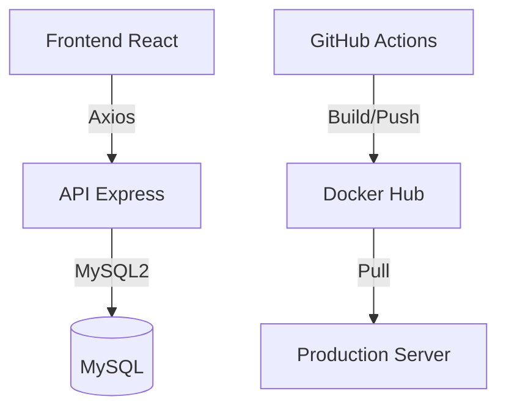
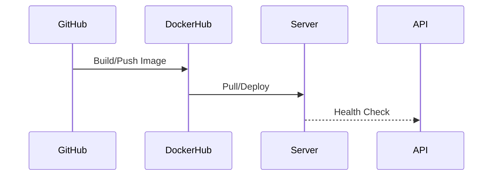

# 📘 Documentation du Projet Fullstack avec CI/CD

---

## 1. 📌 Présentation Générale
Ce projet est une application **fullstack** développée avec :

- **Backend** : Node.js (Express) + MySQL  
- **Frontend** : React.js  
- **Infrastructure** : Docker + Docker Compose  
- **CI/CD** : GitHub Actions

Il implémente un système **CRUD** complet pour la gestion d'utilisateurs, avec des **tests automatisés** et un **déploiement continu**.

---

## 2. 🏗️ Architecture Technique

### 2.1 Structure des Fichiers

**Backend** (`/backend`)  
• `Dockerfile` - Configuration Docker  
• `app.js` - Point d'entrée principal  
• `routes/` - Contrôleurs API  
• `test/` - Tests unitaires et d'intégration  

**Frontend** (`/frontend`)  
• `Dockerfile` - Build de production  
• `src/` - Code source React  

**Fichiers racine**  
• `docker-compose.yml` - Environnement de développement  
• `docker-compose.prod.yml` - Configuration production  
• `.github/workflows/` - Pipeline CI/CD  

### 2.2 🧬 Schéma d'Architecture


---

## 3. ⚙️ Configuration Requise

### 3.1 🔧 Prérequis
- Docker 20.10+  
- Node.js 18+  
- MySQL 8.0+  
- Git 2.30+

### 3.2 🔐 Variables d'Environnement
Fichier `backend/.env` :
```ini
DB_HOST=localhost
DB_USER=root
DB_PASSWORD=votre_mot_de_passe
DB_NAME=usersdb
PORT=5000
```

---

## 4. 🚀 Installation et Exécution

### 4.1 🧪 Développement Local
```bash
# 1. Lancer les conteneurs
docker-compose up -d

# 2. Installer les dépendances
cd backend && npm install
cd ../frontend && npm install

# 3. Démarrer les serveurs
npm run dev   # Backend
npm start     # Frontend
```

### 4.2 🏁 Production
```bash
docker-compose -f docker-compose.prod.yml up -d
```

---

## 5. 🧪 Tests Automatisés

### 5.1 ✅ Stratégie de Test
| Type        | Outils        | Couverture   |
|-------------|---------------|--------------|
| Unitaires   | Mocha/Chai    | 80%+         |
| Intégration | Supertest     | Routes API   |
| E2E         | (À implémenter)| -           |

### 5.2 ▶️ Exécution des Tests
```bash
# Backend
cd backend
npm test

# Rapport de couverture
npm run test:coverage
```

---

## 6. 🔁 Pipeline CI/CD

### 6.1 ⚙️ Workflow GitHub Actions
```yaml
name: CI/CD
on: [push]
jobs:
  test:
    runs-on: ubuntu-latest
    services:
      mysql:
        image: mysql:8
        env:
          MYSQL_ROOT_PASSWORD: root
          MYSQL_DATABASE: testdb
    steps:
      - uses: actions/checkout@v4
      - run: npm ci && npm test
  deploy:
    needs: test
    steps:
      - uses: docker/build-push-action@v4
        with:
          push: true
          tags: user/app:latest
```

### 6.2 📈 Diagramme CI/CD


---

## 7. 🧠 Décisions Techniques

### 7.1 🧱 Choix Architecturaux
- **Modulaire** : Séparation claire backend/frontend  
- **Conteneurisation** : Isolation des dépendances  
- **Multi-stage builds** : Optimisation des images Docker  

### 7.2 ⚡ Optimisations
- Cache des layers Docker  
- Tests parallèles  
- Gestion centralisée des erreurs  

---

## 8. ☁️ Déploiement

### 8.1 🔨 Préparation
```bash
# Build des images
docker-compose -f docker-compose.prod.yml build

# Push vers Docker Hub
docker-compose -f docker-compose.prod.yml push
```

### 8.2 🔐 Variables de Production
| Variable     | Valeur Exemple |
|--------------|----------------|
| DB_HOST      | mysql-prod     |
| NODE_ENV     | production     |
